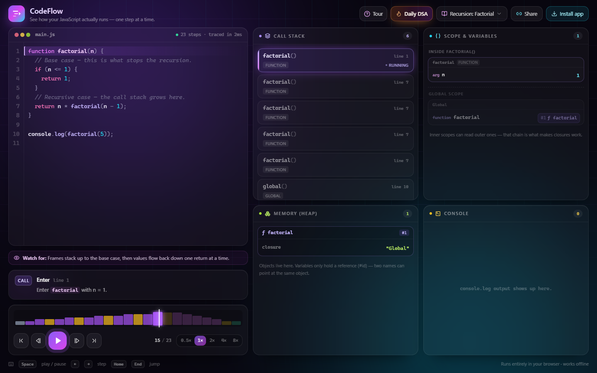
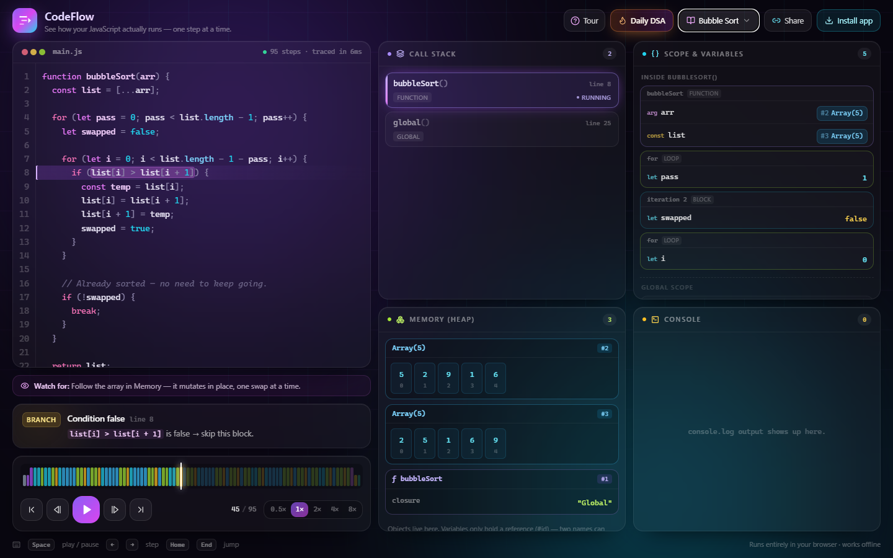
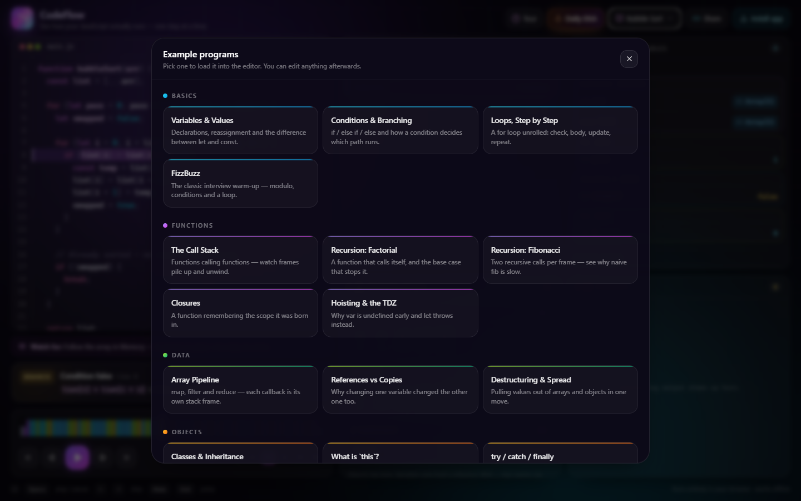
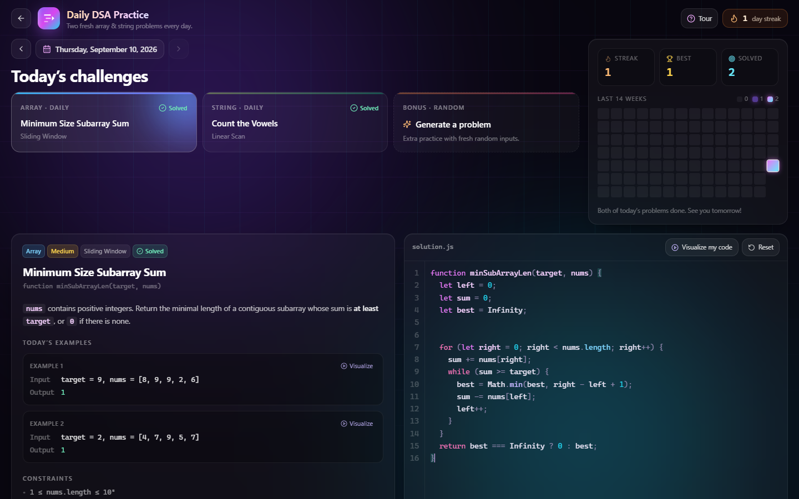
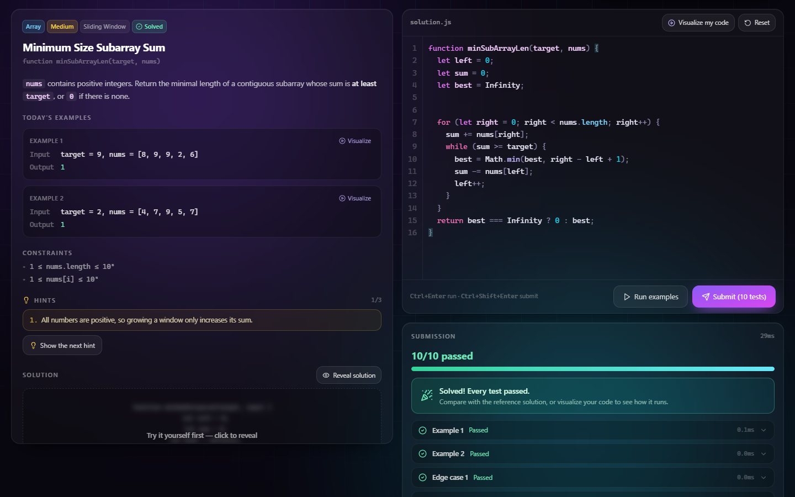
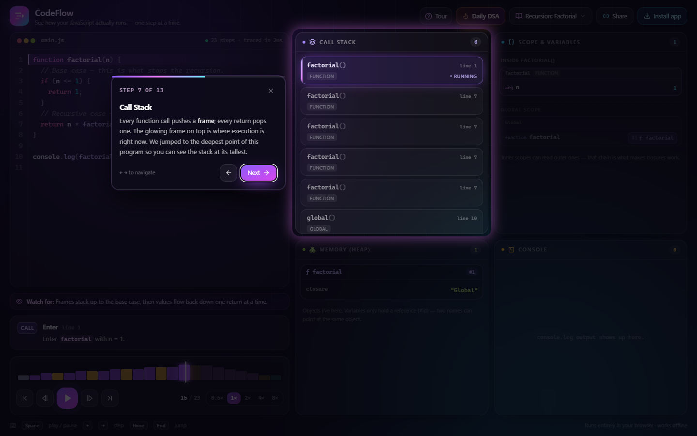
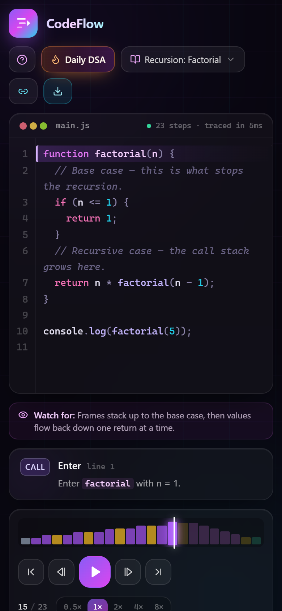
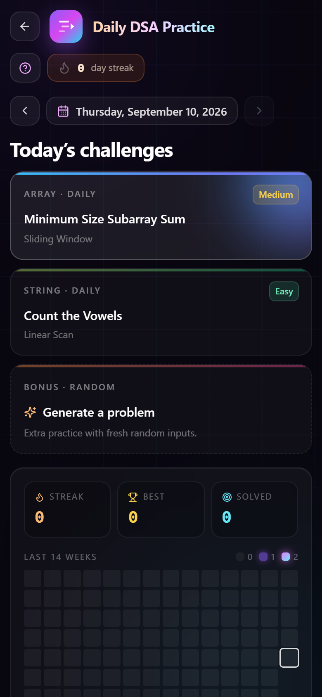

# CodeFlow

**See how your JavaScript actually runs — one step at a time.**



CodeFlow is an interactive code execution visualizer for developers and students. Paste or write
JavaScript, then play, pause, or scrub through its execution while the call stack, scopes,
heap memory and console update live — with a plain-English explanation of every step.

It's a Next.js app and an installable, offline-capable PWA. Everything runs in the browser; no code
is ever sent to a server.

## Screenshots

| Memory: watch an array mutate in place | 18 guided examples |
|:---:|:---:|
|  |  |

| Daily DSA practice | Run tests and get instant feedback |
|:---:|:---:|
|  |  |

**Guided walkthrough for first-time visitors**



**Works on phones too**

<p align="center">
  
  &nbsp;&nbsp;&nbsp;
  
</p>

## Features

- **Step-by-step execution** — play/pause, step forward *and backward*, jump to start/end, 5 speeds.
- **Execution landscape timeline** — every step as a bar, coloured by kind (call, loop, branch,
  output…) and sized by call-stack depth, so recursion literally looks like mountains. Drag to scrub.
- **Live editor highlighting** — the current line and the exact expression being evaluated.
- **Narration** — each step is explained: *"`n <= 1` is false → skip this block."*
- **Call Stack** — frames animate on and off as functions are called and return; shows `this`.
- **Scope & Variables** — the full scope chain (function, block, loop, catch), `let`/`const`/`var`
  kinds, values flashing when they change, and the temporal dead zone shown as *uninitialized*.
- **Memory (Heap)** — objects, arrays, class instances and functions as cards with stable `#id`s, so
  shared references and in-place mutation are visible. Arrays render as indexed cells.
- **Console** — output appears as it's printed; click an entry to jump to the step that printed it.
- **18 guided examples** — variables, loops, recursion, closures, hoisting/TDZ, references vs copies,
  destructuring, classes & inheritance, `this`, try/catch/finally, bubble sort, binary search,
  memoization — each with a "watch for" hint.
- **Share links** — the code is encoded into the URL hash. Your last program is remembered locally.
- **Daily DSA practice** (`/practice`, the **Daily DSA** button in the header) — see below.
- **Guided walkthrough** — first-time visitors get a short spotlight tour of each page (13 steps
  on the visualizer, 10 on the practice page). It jumps the program to telling moments — e.g. the
  deepest recursion for the Call Stack step — and switches panels on phones. Replay it anytime
  with the **Tour** button; navigate with `←` `→`, close with `Esc`.
- **PWA** — installable, works fully offline, custom icons.
- **Keyboard** — `Space` play/pause · `←` `→` step · `Home` `End` jump.

## Daily DSA practice

Every day brings **one array problem and one string problem**, drawn from a bank of 52 (28 array,
24 string) covering two pointers, sliding windows, prefix sums, hashing, binary search, stacks,
greedy and more.

- **New inputs every day.** Examples and tests are generated from the date, so the same problem
  returning weeks later comes with fresh inputs. Expected outputs are computed by the reference
  solution, so examples can never disagree with the answer key.
- **Write and test** in the editor: *Run examples* (`Ctrl+Enter`) checks the visible examples;
  *Submit* (`Ctrl+Shift+Enter`) runs every example, edge case and hidden test. Code runs in a Web
  Worker with a 3-second limit, so an infinite loop can't freeze the page.
- **Progressive hints**, then a reveal-able **reference solution** with explanation and complexity.
- **Visualize** — open the reference solution, or your own code, in the step-by-step visualizer on
  today's example.
- **Streaks** — a day-streak counter, best streak, total solved, and a 14-week heatmap. Click any
  past day to practise from the archive. A **Bonus** card generates extra random problems.
- Progress and drafts are saved in your browser (`localStorage`); nothing leaves your device.

The problem bank lives in [src/lib/dsa/problems/](src/lib/dsa/problems/). `npm run test:dsa`
validates every problem across many dates, including that the visualizer's interpreter produces
the same answers as the reference solutions.

## Getting started

Requires [Node.js](https://nodejs.org/) 18.18 or newer (developed on Node 20).

```bash
git clone https://github.com/giraseyadnesh1999/gitLearn.git
cd gitLearn
npm install
npm run dev        # http://localhost:3000
```

The dev server writes to `.next-dev/` and production builds to `.next/`, so you can run
`npm run build` while `npm run dev` is still running.

Production build:

```bash
npm run build
npm start
```

> The service worker only registers in production builds (`npm run build && npm start`), so test
> installability and offline mode there, not in `npm run dev`.

Other scripts:

```bash
npm test           # interpreter test suite (semantics + every bundled example)
npm run test:dsa   # validates all 52 practice problems
npm run lint       # ESLint
npm run icons      # regenerate the PWA PNG icons (dependency-free)
```

## How it works

CodeFlow doesn't `eval` your code. It ships its own JavaScript interpreter
([src/lib/interpreter/](src/lib/interpreter/)):

1. **Parse** — [acorn](https://github.com/acornjs/acorn) turns the source into an AST with locations.
2. **Evaluate** — [evaluator.ts](src/lib/interpreter/evaluator.ts) walks the AST as a *generator*,
   `yield`ing at every meaningful point (declaration, call, return, branch, loop check, …). Scopes,
   hoisting, closures, per-iteration `let` bindings, classes with `super`, destructuring, optional
   chaining and try/catch/finally are implemented properly, not faked.
3. **Snapshot** — [run.ts](src/lib/interpreter/run.ts) pumps the generator and
   [snapshot.ts](src/lib/interpreter/snapshot.ts) records an immutable view of the machine after each
   step. Because the whole trace is precomputed, scrubbing backwards is instant.

Builtins that call back into user code (`map`, `filter`, `reduce`, `sort`, `forEach`, …) are
generator natives too, so each callback invocation shows up as its own stack frame.

### Supported JavaScript

Variables (`let`/`const`/`var`), functions, arrows, closures, default/rest params, spread,
destructuring, template literals, `if`/`switch`/ternary, `for`/`for…of`/`for…in`/`while`/`do…while`,
labelled `break`/`continue`, classes (fields, static members, `extends`, `super`), `new` with
constructor functions, `this`, `try`/`catch`/`finally`/`throw`, optional chaining, `??`, logical
assignment, `Map`, `Set`, `new Array(n)`, regex `test`/`replace`, plus `console`, `Math`, `JSON`,
`Object`, `Array`, `Number`, `String.fromCharCode`, and common string/array methods.

**Not supported (yet):** `async`/`await`, generators, getters/setters, and modules. These show a
clear "unsupported" message rather than running incorrectly. Execution stops after 6,000 steps to
catch infinite loops.

## Tech stack

- [Next.js 15](https://nextjs.org/) (App Router) + React 19 + TypeScript
- [Framer Motion](https://www.framer.com/motion/) for animation
- [Tailwind CSS](https://tailwindcss.com/) for styling
- [CodeMirror 6](https://codemirror.net/) for the editor
- [acorn](https://github.com/acornjs/acorn) for parsing
- A hand-written service worker ([public/sw.js](public/sw.js)) for offline support

## Project layout

```
src/
  app/
    page.tsx              the visualizer (/)
    practice/page.tsx     Daily DSA practice (/practice)
    layout.tsx            PWA metadata, global backdrop
  components/
    Visualizer.tsx        visualizer shell: editor, panels, controls, picker
    practice/             practice page: challenges, problem, results, streaks
    tour/                 guided walkthrough (spotlight tour)
  lib/
    interpreter/          parser driver, evaluator, scopes, builtins, snapshots
    dsa/                  problem bank, daily selection, test runner, progress
    examples.ts           the guided example programs
    share.ts              share-link encoding
public/
  manifest.webmanifest    PWA manifest
  sw.js                   service worker
  dsa-worker.js           sandboxed test runner for practice solutions
  icons/                  generated app icons
scripts/
  test-interpreter.ts     interpreter test suite
  test-dsa.ts             problem-bank validation
  generate-icons.mjs      icon generator
docs/
  screenshots/            images used in this README
```
